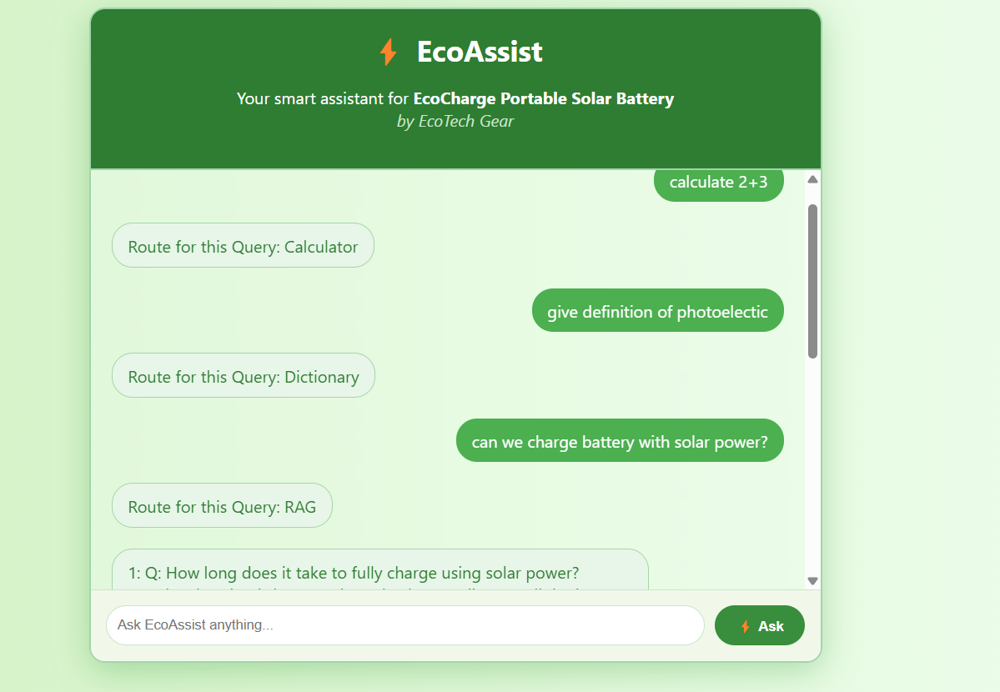

# RAG-Powered Multi-Agent Q&A Assistant
This project implements a **Retrieval-Augmented Generation (RAG)** based search system designed to provide accurate, conversational answers to customer queries about the **EcoCharge 2000—a portable solar battery by EcoTech Gear.(Just taken For example)** 
By integrating structured product information, FAQs, specifications, policies, and usage guidance into a retrievable knowledge base, the system enables users to ask natural language questions and receive contextually relevant answers. Whether a customer wants to know about charging methods, warranty details, or the product's durability in outdoor conditions, the RAG pipeline ensures efficient and reliable access to trusted information, enhancing user experience and support automation.

## Chatbot Interface
Here’s how the chatbot interface looks:

---

## Workflow

### 1. **User Input**
- The user provides a query through the chatbot interface.

### 2. **Sentence Embedding**
- The query is embedded into a vector representation using the **`SentenceTransformer`** model (`all-MiniLM-L6-v2`).

### 3. **Intent Classification**
- The embedded query is compared against pre-stored intent vectors in the **`intent_classifier`** collection (stored in ChromaDB).
- The nearest intent is determined using vector similarity.

### 4. **Routing**
The query is routed based on the classified intent:
- **Calculator** → Perform calculations via an API or function.
- **Dictionary** → Fetch definitions or explanations.
- **RAG (Retrieval-Augmented Generation)** → Retrieve documents and generate an answer.

### 5. **RAG Pipeline**
If the query is routed to RAG:
1. **Document Retrieval**:
   - Query embedding → Compare with document embeddings in **`chunks_storage`** (ChromaDB).
   - Retrieve the top 3 most relevant documents.
2. **Answer Generation**:
   - Retrieved documents → Passed as context to the **LLM**.
   - LLM → Generates a precise answer based on the query and context.

### 6. **Chatbot Interface**
- All steps (classification, routing, and answer generation) are displayed in the chatbot interface for transparency and user understanding.

---

## Visual Workflow with Arrows

1. **User Input**  
   → **Sentence Embedding**  
   → **Intent Classification**  
   → **Routing**:
   - Calculator → Perform Calculation
   - Dictionary → Fetch Definition
   - RAG → **Document Retrieval**  
     → **Answer Generation**  
     → **Chatbot Interface**

---

## Example Query Flow

### Query: "What is the definition of renewable energy?"
1. **User Input** → "What is the definition of renewable energy?"
2. **Sentence Embedding** → Query embedded using `SentenceTransformer`.
3. **Intent Classification** → Classified as "dictionary."
4. **Routing** → Fetch definition from the dictionary pipeline.
5. **Output** → The chatbot displays the definition.

---

This arrow-based structure provides a clear and concise representation of the workflow. Let me know if you'd like further refinements!# RAG-Powered Multi-Agent Q&A Assistant

## Workflow

### 1. **User Input**
- The user provides a query through the chatbot interface.

### 2. **Sentence Embedding**
- The query is embedded into a vector representation using the **`SentenceTransformer`** model (`all-MiniLM-L6-v2`).

### 3. **Intent Classification**
- The embedded query is compared against pre-stored intent vectors in the **`intent_classifier`** collection (stored in ChromaDB).
- The nearest intent is determined using vector similarity.

### 4. **Routing**
The query is routed based on the classified intent:
- **Calculator** → Perform calculations via an API or function.
- **Dictionary** → Fetch definitions or explanations.
- **RAG (Retrieval-Augmented Generation)** → Retrieve documents and generate an answer.

### 5. **RAG Pipeline**
If the query is routed to RAG:
1. **Document Retrieval**:
   - Query embedding → Compare with document embeddings in **`chunks_storage`** (ChromaDB).
   - Retrieve the top 3 most relevant documents.
2. **Answer Generation**:
   - Retrieved documents → Passed as context to the **LLM**.
   - LLM → Generates a precise answer based on the query and context.

### 6. **Chatbot Interface**
- All steps (classification, routing, and answer generation) are displayed in the chatbot interface for transparency and user understanding.

---

## Visual Workflow with Arrows

1. **User Input**  
   → **Sentence Embedding**  
   → **Intent Classification**  
   → **Routing**:
   - Calculator → Perform Calculation
   - Dictionary → Fetch Definition
   - RAG → **Document Retrieval**  
     → **Answer Generation**  
     → **Chatbot Interface**

---

## Example Query Flow

### Query: "What is the definition of renewable energy?"
1. **User Input** → "What is the definition of renewable energy?"
2. **Sentence Embedding** → Query embedded using `SentenceTransformer`.
3. **Intent Classification** → Classified as "dictionary."
4. **Routing** → Fetch definition from the dictionary pipeline.
5. **Output** → The chatbot displays the definition.

---

This arrow-based structure provides a clear and concise representation of the workflow. Let me know if you'd like further refinements!
